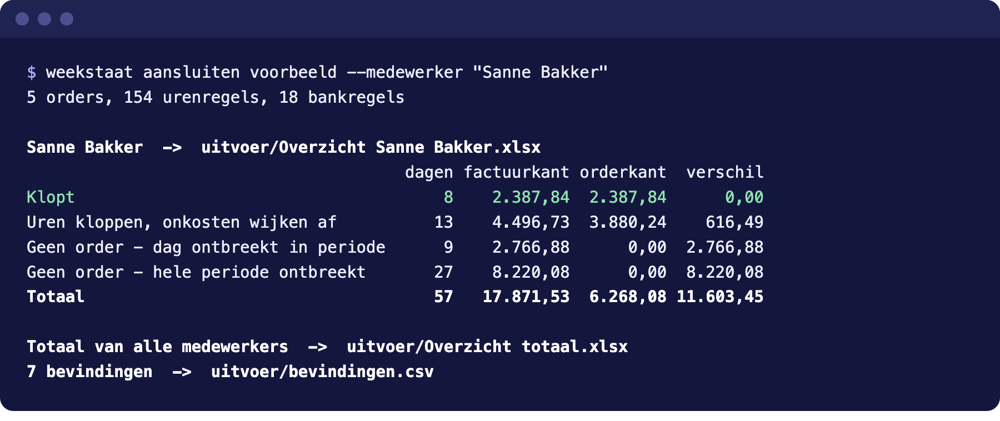
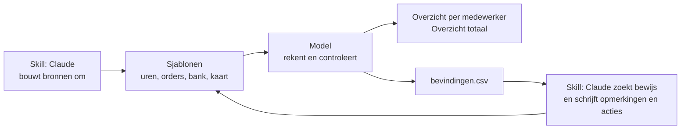

<p align="center">
  <picture>
    <source media="(prefers-color-scheme: dark)" srcset="assets/beeldmerk-donker.svg">
    
  </picture>
</p>

<h1 align="center">Weekstaat</h1>

<p align="center">
  Legt gefactureerde uren naast de orders van de opdrachtgever en de bank, en laat zien waar het niet aansluit.
</p>

<p align="center">
  <a href="https://github.com/t1mvdploeg/weekstaat/actions/workflows/test.yml"></a>
  
  
</p>



Een detacheringsbureau factureert de uren van zijn mensen. Een grote opdrachtgever draait dat vaak om: hij stuurt zelf een order met de uren die hij erkent en betaalt alleen wat daarop staat. Na een jaar lopen de facturen van het bureau, de orders en de bank niet meer gelijk.

Weekstaat legt die drie per dag naast elkaar, voegt de debiteurenkaart uit de boekhouding toe en zegt bij elk verschil wat er aan de hand is.

## Starten

Met Python 3.11 of hoger (pandas 3 komt mee):

```bash
git clone https://github.com/t1mvdploeg/weekstaat.git
cd weekstaat && pip install -e .
weekstaat aansluiten voorbeeld
```

In `uitvoer/` staan daarna de overzichten en `bevindingen.csv`.

## Wat je krijgt

- **Per medewerker** `Overzicht <naam>.xlsx`: vijf hoofdbladen (Stand, Zonder order, Debiteurenkaart, Per periode, Verschillen) en verborgen bladen met het detail. Op Verschillen stelt de tool voor wie aan zet is; je eigen keuze blijft staan als je opnieuw draait.
- **Alle medewerkers samen** `Overzicht totaal.xlsx`: een samenvatting op één scherm, een actielijst en elke factuur zonder order, met grijze bladen voor uitleg en opmerkingen.
- **`bevindingen.csv`**: elke afwijking als lijst, met bedrag, bewijs en een voorstel voor de actie.

Elke gewerkte dag krijgt per order een status: klopt, urenbedrag wijkt af, geen order. Bankontvangsten koppelt de tool aan orders, ook een verzamelbetaling.

## Hoe het werkt



De tool rekent en vindt de afwijkingen, elke keer op dezelfde manier. De [skill](skill/weekstaat/SKILL.md), een instructie voor Claude, laat Claude de bronnen ombouwen, het bewijs zoeken in mails en pdf's en de opmerkingen en acties schrijven. Het taalmodel zit om de tool heen, niet erin.

De skill gebruiken: kopieer `skill/weekstaat` naar `~/.claude/skills/` (of `.claude/skills/` in een project). Hij heeft de map `sjablonen/` en de tool nodig: werk in een kopie van deze repo waar `pip install -e .` is gedaan.

Nodig zijn de uren en de orders (pdf's, ook in een mail, of een sjabloon); bank, debiteurenkaart en hulpbestanden niet. Een urenrapport uit Salesforce, een export van de Rabobank en een debiteurenkaart bouwt de tool zelf om (`omzetten-uren`, `omzetten-bank`, `omzetten-kaart`). Orders in Word, Excel of een andere pdf-opmaak gaan via het sjabloon `orders.csv`; de tool controleert dat de regels optellen tot het ordertotaal. Alle kolommen staan in [`sjablonen/README.md`](sjablonen/README.md).

In `instellingen.toml` staan de namen, entiteiten, rekeningen met aandeel, btw, blok van de orders en betaaltermijn.

## De voorbeeldset

`voorbeeld/` heeft twee medewerkers, 5 orders (pdf's en mails, met een dubbele order en twee orders in één pdf), 154 urenregels, 18 bankregels, een debiteurenkaart van 16 regels, opmerkingen en een actielijst. Alles is verzonnen. In `voorbeeld/ruw/` staan de exports die `omzetten` omzet.

De tests leggen de uitkomst vast in `voorbeeld/verwacht/`: 86 dagen, alle bankregels, stand, verschillen en bevindingen. Ze bouwen ook verzonnen dossiers die elk één situatie nabootsen, zoals geen bank of kaart, één rekening, een ander btw-tarief, een dubbele of vervangen order of een creditorder die later wordt verrekend. In de praktijk is hij op één dossier gebruikt; de scenario's zijn verzonnen.

## Wat het niet doet

- Het leest zelf één opmaak van order-pdf's, die van de voorbeeldset. De tekst van een mail leest het niet, de pdf-bijlagen in `mail/` wel. Word en andere opmaken doet Claude via de skill.
- Het beslist niet wie gelijk heeft. Het saldo en de opmerkingen zijn voorstellen.
- Het boekt niets en koppelt met geen systeem.
- Bij even grote betalingen op één dag of een deels afgeletterde kaart koppelt het op volgorde; uren onder tarief 20 telt het als correctie.

## Ontwikkelen

```bash
pip install -e ".[dev]"
pytest
ruff check . && ruff format --check .
```

Licentie: [MIT](LICENSE).
